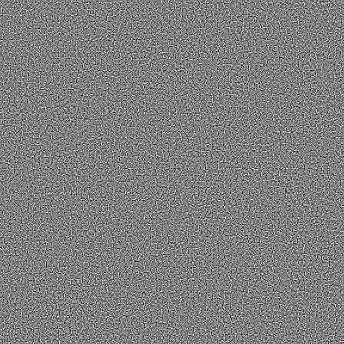
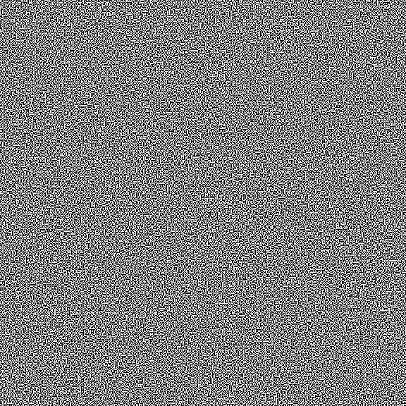
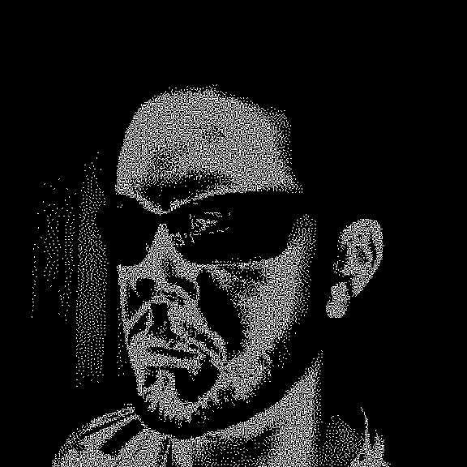

Work in progress...

## VisualKrypto

"Hide a image / text image into two diffrent images. After submission of this two we can see a encrypted ones." 

Copy [of](https://github.com/michal93cz/VisualKrypto) but patched for pyton3, and other fixes (to my liking).

### Explanation

From one image, generate two "encrypted" ones, take them, overlay them and you get a trace of the original.

<table>
      <tr><td></td><td>➡️</td><td></td><td>➕</td><td></td><td>➡️</td><td></td></tr>
</table>

This technique is similar (visually) to the one used in [Electrum](https://bitcoin.org/en/wallets/desktop/linux/electrum/) (a bitcoin wallet app), but they implement a professional solution offered by a [company](https://revealer.cc/index.php/).The goal is to print the 2 images physically to store the "secret" analogically, not on a digital medium, but offering a minimum of security.

<!-- Markdown Github ver. not support tables without headers
  Original |  | 1 |  | 2 |  | Final 
  --- | --- | --- | --- | --- | --- | --- 
   | ➡️ |  | ➕ |  | ➡️ | 

-->

### Use
- Put your "original.bmp" in the same directory.
- Run.

### Conditions/Limitations
- Python3

- Input image:
  - .bmp (bitmap) format.
  - Color depth 1 bpp (monochrome, black-white only).
  - Dimensions 1:1 (square image)
